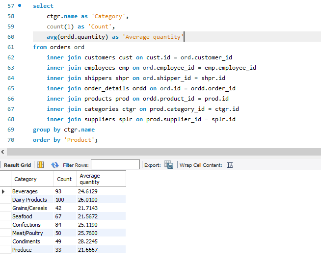

# Опис домашнього завдання

## 1. Створіть базу даних для керування бібліотекою книг згідно зі структурою, наведеною нижче. Використовуйте DDL-команди для створення необхідних таблиць та їх зв'язків.
 

Структура БД

a) Назва схеми — “LibraryManagement”

b) Таблиця "authors":

    author_id (INT, автоматично зростаючий PRIMARY KEY)
    author_name (VARCHAR)

c) Таблиця "genres":

    genre_id (INT, автоматично зростаючий PRIMARY KEY)
    genre_name (VARCHAR)

d) Таблиця "books":

    book_id (INT, автоматично зростаючий PRIMARY KEY)
    title (VARCHAR)
    publication_year (YEAR)
    author_id (INT, FOREIGN KEY зв'язок з "Authors")
    genre_id (INT, FOREIGN KEY зв'язок з "Genres")

e) Таблиця "users":

    user_id (INT, автоматично зростаючий PRIMARY KEY)
    username (VARCHAR)
    email (VARCHAR)

f) Таблиця "borrowed_books":

    borrow_id (INT, автоматично зростаючий PRIMARY KEY)
    book_id (INT, FOREIGN KEY зв'язок з "Books")
    user_id (INT, FOREIGN KEY зв'язок з "Users")
    borrow_date (DATE)
    return_date (DATE)

## 2. Заповніть таблиці простими видуманими тестовими даними. Достатньо одного-двох рядків у кожну таблицю.

## 3. Перейдіть до бази даних, з якою працювали у темі 3. 

Напишіть запит за допомогою операторів FROM та INNER JOIN, що об’єднує всі таблиці даних, які ми завантажили з файлів: order_details, orders, customers, products, categories, employees, shippers, suppliers. Для цього ви маєте знайти спільні ключі.

Перевірте правильність виконання запиту.

_Наступний запит знаходить всі товари, замовлені певним клієнтом, виводить дані про замовлення, постачальника, службу доставки, ..._

## 4. Виконайте запити, перелічені нижче.

a) Визначте, скільки рядків ви отримали (за допомогою оператора COUNT).

b) Змініть декілька операторів INNER на LEFT чи RIGHT. Визначте, що відбувається з кількістю рядків. Чому? Напишіть відповідь у текстовому файлі.

_Було змінено джоін на кастомерів, щоб включити навіть тих, у кого не було жодного замовлення. Інші таблиці поміняв на лефт джоін, щоб записи без замовлення (і без товарів відповідно) відобразились_

с) На основі запита з пункта 3 виконайте наступне: оберіть тільки ті рядки, де employee_id > 3 та ≤ 10.

d) Згрупуйте за іменем категорії, порахуйте кількість рядків у групі, середню кількість товару (кількість товару знаходиться в order_details.quantity)

e) Відфільтруйте рядки, де середня кількість товару більша за 21.

f) Відсортуйте рядки за спаданням кількості рядків.

g) Виведіть на екран (оберіть) чотири рядки з пропущеним першим рядком.
